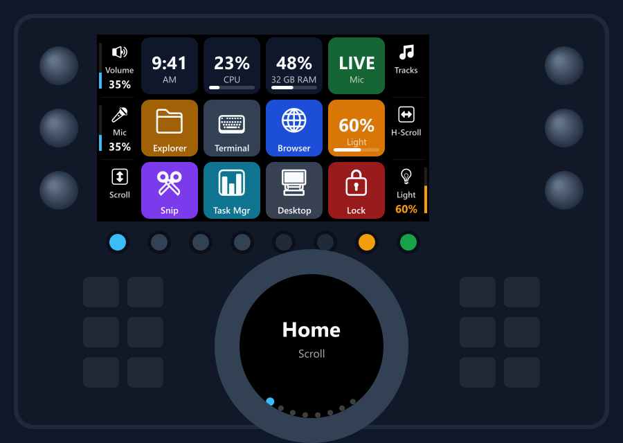
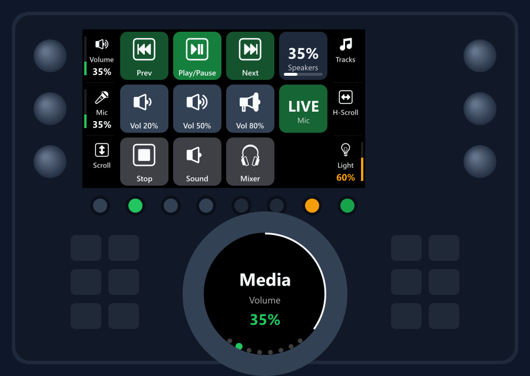
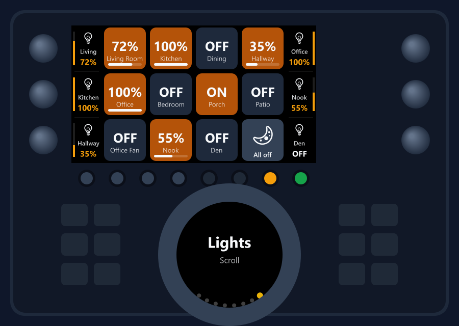
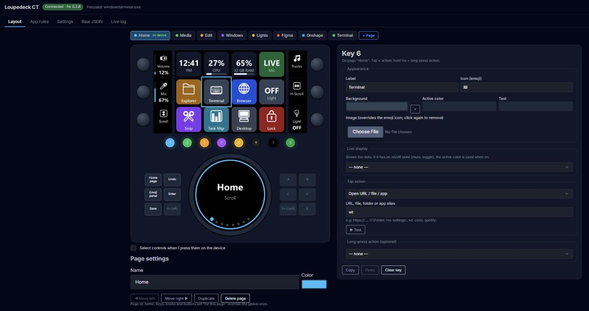
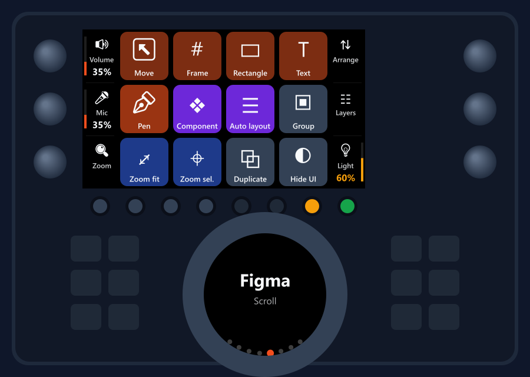
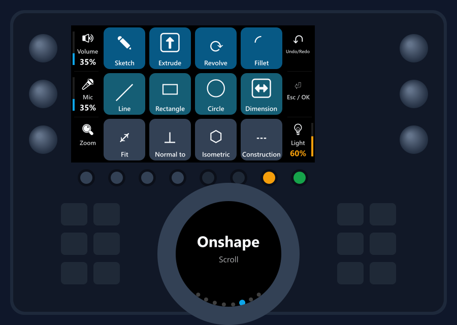
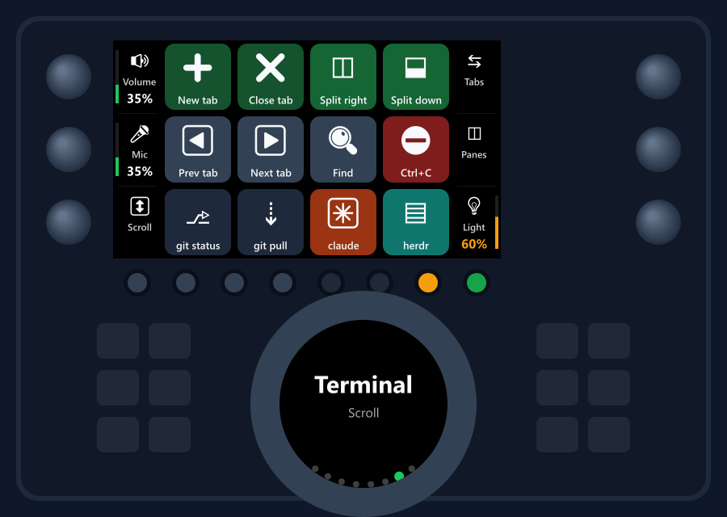

# Loupedeck CT Controller

**Replacement software for the Loupedeck CT that doesn't randomly stop working.**

The Loupedeck CT is great hardware stuck with unreliable software: the official
app freezes, loses the device, and needs restarts. This project drives the CT
directly over USB with a small background service for Windows. It reconnects on
its own and keeps working through unplugs, sleep/wake and device lock-ups. It
also does a lot the official software never could: live data on the keys,
smart-home control, and pages that follow whatever app you're using.



---

## Contents

- [Why this exists](#why-this-exists)
- [Features](#features)
- [Requirements](#requirements)
- [Install](#install)
- [Using it](#using-it)
- [Default layout](#default-layout)
- [App pages](#app-pages)
- [Actions reference](#actions-reference)
- [Live displays reference](#live-displays-reference)
- [Logitech Litra lights](#logitech-litra-lights)
- [Lutron smart lighting](#lutron-smart-lighting)
- [Home Assistant](#home-assistant)
- [How the reliability works](#how-the-reliability-works)
- [Troubleshooting](#troubleshooting)
- [Project layout and development](#project-layout-and-development)
- [Limitations](#limitations)
- [Credits and license](#credits-and-license)

---

## Why this exists

Investigating why the CT "just stops working" turned up two firmware behaviors
(on firmware 0.2.8) that the official software and the open-source driver don't
handle:

1. **The CT can go completely silent on its serial link.** Windows still shows
   it as connected, but it ignores every command. Dropping the serial
   DTR line and raising it again wakes it up instantly. This software does that
   on every connect.
2. **After a previous session, the CT often ignores the first connection
   handshake.** In testing it answered every other attempt. The upstream driver
   sends it once and waits forever. This software re-sends it until the device
   answers.

On top of that, every command has a timeout, a heartbeat detects a stuck device,
and a watchdog restarts the service if it ever crashes. In testing it was
back within about 2 seconds of being force-killed.

## Features

- **Reliable connection.** Reconnects automatically after unplug/replug,
  sleep/wake or a frozen device, and starts automatically at login.
- **Web config UI** at `http://127.0.0.1:20010`, showing the actual device
  screens. Click a key, knob or button, or just press it on the device, to edit it.
  Changes appear on the CT about half a second later. Undo is built in.
- **Live keys.** Clock, CPU, RAM, speaker/mic volume, mic mute state, light levels,
  the output of any PowerShell command, or any value from a JSON web API.
- **App pages.** The deck switches pages automatically when you focus an app,
  including web apps like Figma or Onshape in the browser (matched by window
  title), and switches back when you leave.
- **Gestures.** Swipe the touchscreen to change pages. Long-press any key or
  button for a second action. Tapping a side strip presses that knob.
- **Real system audio control.** Knobs set the actual Windows volume and mic level
  (not fake key presses), and their screens show the current level.
- **Logitech Litra** Glow/Beam lights: on/off, brightness and color temperature.
- **Lutron** Caseta / RadioRA 3 / HomeWorks QSX: lights, dimmers, shades,
  fans and scenes, with live levels that update when someone uses a wall switch.
- **Home Assistant**: lights, switches, fans, scripts and scenes, with live state.
- **Macros.** Keyboard shortcuts, typed text, launching apps and URLs, shell
  commands, HTTP requests, multi-step sequences, and on/off toggles.
- **Plain JSON config** that hot-reloads if you edit it by hand; the previous
  version is kept as a backup.

| | |
|---|---|
|  |  |
| **Media**: transport, volume presets, the wheel controls volume | **Lights**: every Lutron zone with its live level; knobs dim |



## Requirements

- **Windows 10 or 11** (uses Win32 and Core Audio directly)
- **Node.js 20+** ([nodejs.org](https://nodejs.org) or `winget install OpenJS.NodeJS.LTS`)
- **Loupedeck CT** connected by USB (tested on firmware 0.2.8)
- The official **Loupedeck software and Logi Plugin Service must not be running**,
  because only one program can use the device at a time

## Install

```powershell
git clone https://github.com/professionalcrastinationco/loupedeck-ct.git
cd loupedeck-ct
powershell -ExecutionPolicy Bypass -File development\setup.ps1
```

`setup.ps1` checks Node, installs dependencies, warns about conflicting
Loupedeck/Logitech software, registers a per-user scheduled task that starts
the service at login (no admin rights, no console window), and opens the config UI.

Other scripts in `development/`:

| Script | What it does |
|---|---|
| `restart.ps1` | Restart the service (e.g. after `git pull`) |
| `stop.ps1` | Stop the service (the scheduled task will start it again within 10 min) |
| `uninstall-autostart.ps1` | Remove the scheduled task and stop the service |
| `render-screenshots.mjs` | Regenerate the images in this README |

## Using it

Open **http://127.0.0.1:20010**.

- **Pages bar.** Pick the page to edit. Clicking a page also switches the device
  to it. "+ Page", duplicate, reorder, rename and color are under the device.
- **Click any control** (key, knob, round button, square button, wheel) to edit it,
  or tick *"Select controls when I press them on the device"* and press it on the CT.
- **Keys** have an appearance (label, emoji icon or uploaded image, colors), an
  optional live display, a tap action and an optional long-press action.
- **Knobs and the wheel** either run one action that follows the turn direction
  (volume, scroll, brightness, dimming) or separate left/right actions, plus a press
  action. Choose whether a binding applies to **all pages** or **only this page**.
- **▶ Test** runs an action immediately so you can try it without the device.
- **App rules** tab: map a program (`figma.exe`) or a window-title pattern
  (`Onshape`) to a page. "+ Rule for this app" uses whatever is focused right now.
- **Settings**: brightness, haptics, swipe paging, theme colors, and Lutron pairing.
- **Raw JSON** shows the whole config. **Live log** shows device input and service logs.

The config lives in `backend/data/config.json` (created from
`backend/config/default-config.json` on first run).

## Default layout

| Control | Default |
|---|---|
| Round buttons 1-4 | Pages: Home, Media, Edit, Windows (LED shows the page color; the current page is bright) |
| Round button 7 | Litra light on/off (amber while on) |
| Round button 8 | Mic mute (green = live, red = muted) |
| Top-left knob | System volume (press: mute) |
| Middle-left knob | Microphone level (press: mute) |
| Bottom-left knob | Scroll |
| Top-right knob | Previous/next track (press: play/pause) |
| Middle-right knob | Horizontal scroll |
| Bottom-right knob | Litra brightness (press: on/off) |
| Jog wheel | Scroll (press: next page). Media page: volume. Edit: undo/redo. Windows: switch window |
| Square buttons | Home page, Undo (hold: Redo), Save, Enter, Emoji panel |
| Swipe left/right | Next/previous page |

Destructive keys (Lock, Close App, Close tab) only fire on a **long press**.

## App pages

The default config includes example pages that switch automatically:

| Page | Switches when |
|---|---|
| Figma | `figma.exe` is focused, **or** a browser tab titled "… – Figma" |
| Onshape | a window title contains "Onshape" (it runs in the browser) |
| Terminal | Windows Terminal is focused |

| | | |
|---|---|---|
|  |  |  |

If you pick a different page by hand while an app page is active, your choice
sticks until you switch to a different app (or browser tab).

## Actions reference

Every binding is a JSON object with a `type`:

| Type | Fields | Example |
|---|---|---|
| `hotkey` | `keys` (string, or array for a sequence) | `{"type":"hotkey","keys":"ctrl+shift+t"}` |
| `hold` | `keys`, held while the control is held | `{"type":"hold","keys":"shift"}` |
| `type` | `text` (`\n` presses Enter) | `{"type":"type","text":"git status\n"}` |
| `open` | `target`: URL, file, folder, `ms-settings:` URI or app alias | `{"type":"open","target":"https://github.com"}` |
| `launch` | `path`, `args[]`, `cwd` | `{"type":"launch","path":"C:\\Tools\\app.exe"}` |
| `shell` | `command`, `shell`: `powershell` or `cmd` (runs hidden) | `{"type":"shell","command":"Stop-Process -Name Teams"}` |
| `media` | `key`: `playpause` `next` `prev` `stop` | `{"type":"media","key":"next"}` |
| `volume` | `target`: `speakers` or `mic`; `step` (per click) or `set` (0-1) | `{"type":"volume","target":"mic","step":0.02}` |
| `mute` | `target`; `mode`: `toggle` `on` `off` | `{"type":"mute","target":"mic"}` |
| `scroll` | `amount` (notches, negative = down), `horizontal` | `{"type":"scroll","amount":-1}` |
| `page` | `page`: a page id, or `next` `prev` `back` | `{"type":"page","page":"media"}` |
| `light` | Litra. `op`: `toggle` `on` `off` `brightness` `temperature`; `step` / `set` | `{"type":"light","op":"brightness","step":0.05}` |
| `lutron` | `op`: `toggle` `on` `off` `level` `fan` `scene`; `zone`, `scene`, `set`, `step`, `speed` | `{"type":"lutron","op":"level","zone":"5","step":4}` |
| `ha` | Home Assistant. `op`: `toggle` `on` `off` `level` `run`; `entity`, `set`, `step` | `{"type":"ha","op":"toggle","entity":"light.desk_lamp"}` |
| `brightness` | Deck screen brightness, `step` or `set` | `{"type":"brightness","step":0.05}` |
| `haptic` | `pattern` (e.g. `SHORT`, `BUZZ`, `RUMBLE2`) | `{"type":"haptic","pattern":"SHORT"}` |
| `http` | `method`, `url`, `headers`, `body` | `{"type":"http","method":"POST","url":"http://…"}` |
| `toggle` | `id`, `on` (action), `off` (action). Pair with a `toggle` live display | |
| `multi` | `actions[]`, `delay` (ms between) | |
| `delay` | `ms` (inside `multi`) | |

Key names for `hotkey`: `ctrl shift alt win`, `a`-`z`, `0`-`9`, `f1`-`f24`,
`enter esc tab space backspace delete insert home end pageup pagedown`,
`up down left right`, `printscreen`, `num0`-`num9`, punctuation such as `,` `.` `/` `;` `[` `]` `-` `=`
(or by name: `comma period slash semicolon quote lbracket rbracket minus equals backslash backtick`),
and media keys `volumeup volumedown volumemute playpause medianext mediaprev`.

When a knob uses a single "turn" action, `volume`, `scroll`, `brightness`,
`light` and `lutron` follow the turn direction and speed. The `sensitivity` setting scales it.

## Live displays reference

Add `"widget": {...}` to a key, knob or button:

| Type | Shows | Fields |
|---|---|---|
| `clock` / `date` | Time / date | `format`: `12h` or `24h` |
| `cpu` / `memory` | Usage with a bar | |
| `volume` | Level, "MUTED" | `target` |
| `mute` | LIVE / MUTED (active = muted) | `target` |
| `light` | Litra brightness or temperature | `show` |
| `lutron` | Zone level / ON / OFF | `zone` |
| `ha` | Home Assistant level / ON / OFF | `entity` |
| `toggle` | State of a `toggle` action | `id`, `onText`, `offText` |
| `page` | Current page name | |
| `command` | First line of a PowerShell command's output (second line = caption) | `command`, `interval` (s) |
| `http` | A value from a JSON API | `url`, `path` (e.g. `data.price`), `prefix`, `suffix`, `decimals`, `interval` |

Displays with an on/off state use the binding's `activeColor` while active. On
round buttons, that color goes to the button's LED.

A key can use any [Phosphor icon](https://phosphoricons.com) instead of an emoji:
`"phosphor": "lightbulb"` (optional `"phosphorWeight"`: `fill` (default), `regular`,
`bold`, `light`, `thin`, `duotone`). The icon is tinted to the key's text color. Add
`"hideValue": true` to drop the display text (e.g. "ON"/"OFF") and let the icon and
background color show the state; dimmers still show their level bar.

## Logitech Litra lights

Plug in a Litra Glow or Beam and it just works. Nothing to configure. The defaults put
on/off on round button 7 and brightness on the bottom-right knob. The light's
state stays in sync even if you change it with its own buttons or Logi Tune.

## Lutron smart lighting

Works with LEAP bridges: **Caseta Smart Bridge / Smart Bridge Pro, RadioRA 3,
HomeWorks QSX**. Everything stays on your local network; nothing goes through the cloud.

1. In the UI, go to **Settings → Lutron** and click **Find bridge** (or type its IP).
2. Click **Pair**, then **quickly tap** the small button on the back of the bridge.
   > A quick tap only authorizes this app. It does not affect your existing
   > devices, scenes or other integrations. **Do not hold the button:** holding
   > it for about 15 seconds factory-resets the bridge.
3. Your zones appear in the action and live-display editors (choose "Lutron").

The pairing certificate is stored in `backend/data/lutron.json` and never leaves
your machine (that folder is git-ignored). Command-line alternative:
`cd backend; node src/lutron-pair.js [bridge-ip]`.

Dimming with a knob is smooth even when you spin it fast. While a light fades,
the bridge reports in-between levels; the software ignores those for a moment
and only sends the newest level, so the light doesn't bounce up and down.

## Home Assistant

1. In Home Assistant, open your profile → **Security** → **Long-lived access tokens**
   and create one (e.g. named "Loupedeck CT").
2. In the UI, go to **Settings → Home Assistant**, enter your Home Assistant URL
   (e.g. `http://homeassistant.local:8123`) and the token, and click **Connect**.
3. Your lights, switches, fans, scripts and scenes appear in the action and
   live-display editors (choose "Home Assistant").

The URL and token are stored in `backend/data/homeassistant.json` (git-ignored).
The connection uses Home Assistant's WebSocket API, so keys update the moment
something changes elsewhere, and it reconnects on its own if Home Assistant
restarts. Knob dimming uses the same anti-bounce handling as Lutron.

If a light is also on a Lutron bridge, control it through one integration only.

## How the reliability works

```
scheduled task (logon + every 10 min)
  └─ start-hidden.vbs ─ run.js (watchdog: restarts on crash, 1 s → 30 s backoff)
                          └─ main.js
                               ├─ device.js      connect/handshake retries, DTR wake-up, timeouts,
                               │                 4 s heartbeat, reconnect forever, coalescing output queue
                               ├─ controller.js  input → actions, pages, gestures, app rules,
                               │                 redraws only what changed
                               ├─ actions.js     every action is caught; a bad binding can't crash anything
                               └─ server.js      UI + API on 127.0.0.1 only
```

- Only changed keys and screens are redrawn, and a newer frame for the same key
  replaces an older one still waiting to be sent, so the device is never flooded.
- If a command times out, the screen is fully redrawn so nothing is left showing old content.
- The config is validated before saving. A broken file on disk falls back to the
  last good copy instead of failing to start.
- The Litra driver's blocking reads could hang or return stale values, so this
  project uses its own reads that match each request to its reply and time out.

## Troubleshooting

| Symptom | Fix |
|---|---|
| UI says **"Searching for device…"** | Check that the official Loupedeck app or Logi Plugin Service isn't running (Task Manager). Quit it and disable it under Startup apps. |
| `COM3 is in use by another program` in the log | Same as above. |
| UI won't load | Run `development\restart.ps1`; check `backend\data\logs\loupedeck.log`. |
| A shortcut doesn't work in an elevated (admin) window | Windows blocks input from normal apps into admin windows. |
| Lutron shows "reconnecting" | Check that the bridge is reachable. If it got a new IP, use *Forget bridge* and pair again (or give it a DHCP reservation). |

Logs: `backend\data\logs\loupedeck.log` (2 MB, rotated), also in the UI's **Live log** tab.

## Project layout and development

```
backend/        Node service (src/), default config, tests run from here
frontend/       Config UI (plain JS + Pico CSS, no build step)
development/    Install/start/stop scripts, screenshot renderer
testing/        Tests (node:test, using a fake device: no hardware needed)
docs/           This README and images
```

```powershell
cd backend
npm install
npm run dev        # run in the foreground (no watchdog)
npm test           # 14 tests: input, paging, gestures, rendering, app rules, Lutron dimming
```

Set `LD_DEBUG=1` for verbose logs and `LD_PORT` to change the UI port (default 20010).

**Security:** the service only listens on `127.0.0.1` and rejects requests whose
`Host`/`Origin` aren't the UI itself. Bindings can run shell commands, so this
stops other websites from reprogramming your deck.

## Limitations

- **Windows only** (keyboard injection, audio and window detection use Win32 APIs).
- **Loupedeck CT only.** The Live, Live S and Razer Stream Controller use the same
  protocol and could be added, but the layout here is CT-specific.
- No plugin marketplace or Loupedeck profile import. Bindings are built in the UI or JSON.

## Credits and license

Built on [`loupedeck`](https://github.com/foxxyz/loupedeck) (MIT) by foxxyz,
[`litra`](https://github.com/timrogers/litra) (MIT) by Tim Rogers,
[`lutron-leap`](https://github.com/thenewwazoo/lutron-leap-js) (GPL-3.0) by Brandon Matthews,
[`home-assistant-js-websocket`](https://github.com/home-assistant/home-assistant-js-websocket) (Apache-2.0),
[Phosphor Icons](https://phosphoricons.com) (MIT),
[`koffi`](https://koffi.dev), [`node-canvas`](https://github.com/Automattic/node-canvas)
and [Pico CSS](https://picocss.com).

Not affiliated with Loupedeck, Logitech, Lutron or Home Assistant.

Licensed under the **GNU GPL v3.0** (see [LICENSE](../LICENSE)).
